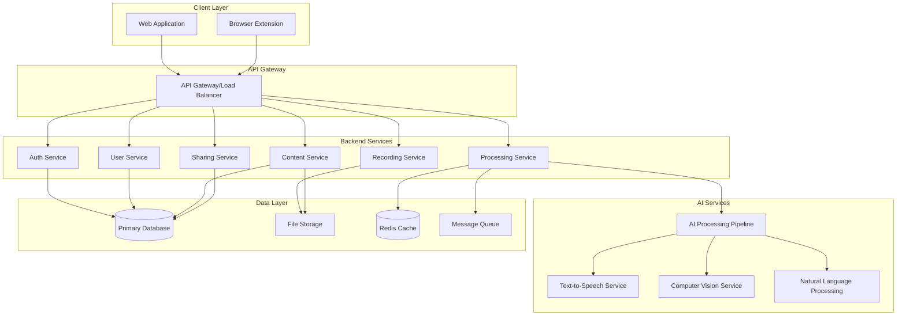
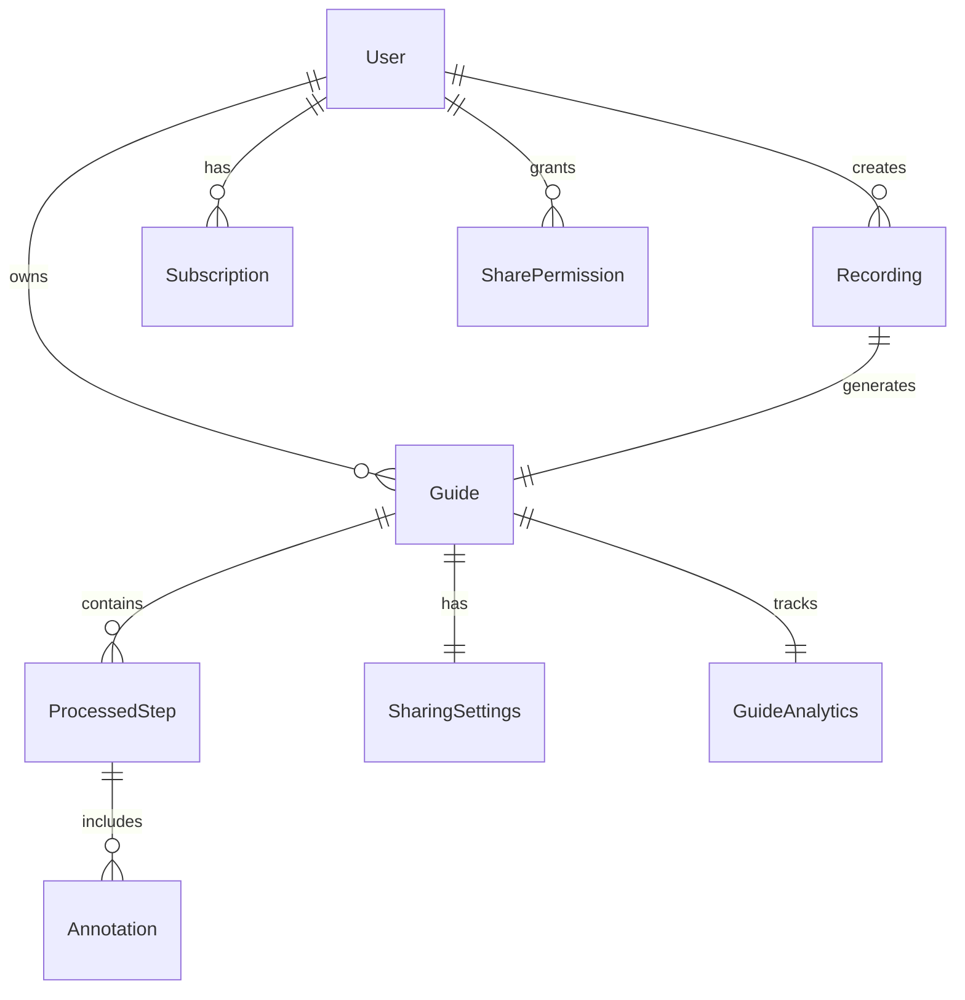

# Design Document: StepFlow Platform

## Overview

StepFlow is a comprehensive AI-powered documentation platform consisting of three main components: a web application, a browser extension, and AI processing services. The platform enables users to capture workflows through screen recording, automatically generate step-by-step documentation using AI, and share professional training materials across teams and organizations.

The system architecture follows a microservices approach with clear separation between the frontend web application, browser extension, backend API services, AI processing pipeline, and data storage layers. This design ensures scalability, maintainability, and the ability to handle concurrent users while processing large media files efficiently.

## Architecture

### High-Level System Architecture



### Technology Stack

**Frontend:**
- Web Application: React 18 with TypeScript, Vite for build tooling
- Browser Extension: Manifest V3, TypeScript, Chrome Extension APIs
- UI Framework: Tailwind CSS with Headless UI components
- State Management: Zustand for client state, React Query for server state

**Backend:**
- API Services: Node.js with Express.js and TypeScript
- Authentication: JWT tokens with refresh token rotation
- File Processing: FFmpeg for video processing, Sharp for image manipulation
- Message Queue: Redis with Bull queue for background job processing

**AI Services:**
- Computer Vision: OpenCV for screenshot analysis and annotation
- Natural Language Processing: OpenAI GPT-4 for content generation
- Text-to-Speech: ElevenLabs API for voice generation
- Image Processing: Custom ML models for step detection and highlighting

**Infrastructure:**
- Database: PostgreSQL for relational data, Redis for caching
- File Storage: AWS S3 for media files with CloudFront CDN
- Deployment: Docker containers on AWS ECS with Application Load Balancer
- Monitoring: CloudWatch for logging, Sentry for error tracking

## Components and Interfaces

### Web Application Components

**Dashboard Component**
- Displays user's guide library in grid/list view
- Implements search, filtering, and categorization
- Handles guide creation, editing, and deletion actions
- Integrates with sharing and analytics features

**Recording Interface**
- Provides screen recording controls and status indicators
- Manages recording permissions and browser compatibility
- Handles real-time step capture and preview
- Coordinates with browser extension for seamless experience

**Editor Component**
- Drag-and-drop interface for guide customization
- Real-time preview with WYSIWYG editing capabilities
- Brand customization tools (colors, logos, fonts)
- Annotation tools (highlights, arrows, blur effects)

**Sharing Interface**
- Link generation and permission management
- Embed code generation for various platforms
- Analytics dashboard for guide performance
- Team collaboration and access control features

### Browser Extension Components

**Content Script**
- Injects recording controls into web pages
- Captures DOM interactions and form submissions
- Handles screenshot capture and step detection
- Communicates with background script for data processing

**Background Script**
- Manages extension lifecycle and permissions
- Coordinates screen recording using Chrome APIs
- Handles data synchronization with web application
- Manages local storage and offline capabilities

**Popup Interface**
- Quick access to recording controls
- Status indicators and recent recordings
- Settings and account management
- Direct links to web application features

### Backend Service Interfaces

**Authentication Service API**
```typescript
interface AuthService {
  register(email: string, password: string): Promise<AuthResponse>
  login(email: string, password: string): Promise<AuthResponse>
  refreshToken(refreshToken: string): Promise<TokenResponse>
  logout(userId: string): Promise<void>
  resetPassword(email: string): Promise<void>
}
```

**Recording Service API**
```typescript
interface RecordingService {
  startRecording(userId: string, metadata: RecordingMetadata): Promise<RecordingSession>
  uploadChunk(sessionId: string, chunk: Buffer): Promise<void>
  completeRecording(sessionId: string): Promise<Recording>
  getRecording(recordingId: string): Promise<Recording>
  deleteRecording(recordingId: string): Promise<void>
}
```

**Content Service API**
```typescript
interface ContentService {
  createGuide(recording: Recording, options: GenerationOptions): Promise<Guide>
  updateGuide(guideId: string, updates: GuideUpdates): Promise<Guide>
  getGuide(guideId: string): Promise<Guide>
  listGuides(userId: string, filters: GuideFilters): Promise<Guide[]>
  deleteGuide(guideId: string): Promise<void>
}
```

**AI Processing Service API**
```typescript
interface AIProcessingService {
  generateSteps(videoData: VideoData): Promise<Step[]>
  generateNarration(steps: Step[], voiceOptions: VoiceOptions): Promise<AudioData>
  enhanceScreenshots(images: ImageData[]): Promise<ImageData[]>
  translateContent(content: Content, targetLanguage: string): Promise<Content>
}
```

## Data Models

### Core Entities

**User Model**
```typescript
interface User {
  id: string
  email: string
  passwordHash: string
  firstName: string
  lastName: string
  planType: 'free' | 'pro' | 'enterprise'
  createdAt: Date
  updatedAt: Date
  preferences: UserPreferences
  subscription?: Subscription
}

interface UserPreferences {
  defaultVoice: string
  defaultLanguage: string
  brandColors: string[]
  logoUrl?: string
  autoGenerateNarration: boolean
}
```

**Recording Model**
```typescript
interface Recording {
  id: string
  userId: string
  title: string
  description?: string
  duration: number
  fileUrl: string
  thumbnailUrl: string
  metadata: RecordingMetadata
  steps: CapturedStep[]
  status: 'processing' | 'completed' | 'failed'
  createdAt: Date
}

interface CapturedStep {
  id: string
  timestamp: number
  action: 'click' | 'type' | 'navigate' | 'scroll'
  element?: string
  coordinates?: { x: number, y: number }
  text?: string
  screenshotUrl: string
}
```

**Guide Model**
```typescript
interface Guide {
  id: string
  userId: string
  recordingId: string
  title: string
  description: string
  steps: ProcessedStep[]
  settings: GuideSettings
  sharing: SharingSettings
  analytics: GuideAnalytics
  status: 'draft' | 'published' | 'archived'
  createdAt: Date
  updatedAt: Date
}

interface ProcessedStep {
  id: string
  order: number
  title: string
  description: string
  screenshotUrl: string
  annotations: Annotation[]
  audioUrl?: string
}

interface GuideSettings {
  theme: string
  brandColors: string[]
  logoUrl?: string
  showStepNumbers: boolean
  autoPlay: boolean
}
```

**Sharing Model**
```typescript
interface SharingSettings {
  isPublic: boolean
  shareUrl: string
  embedCode: string
  allowedDomains: string[]
  passwordProtected: boolean
  expiresAt?: Date
  permissions: SharePermission[]
}

interface SharePermission {
  userId?: string
  email?: string
  role: 'viewer' | 'editor' | 'admin'
  grantedAt: Date
}
```

### Database Schema Relationships



## Error Handling

### Error Classification and Response Strategy

**Client-Side Error Handling**
- Network connectivity issues: Implement retry logic with exponential backoff
- Browser compatibility problems: Graceful degradation with feature detection
- Permission denied errors: Clear user guidance for granting necessary permissions
- File size limitations: Progressive upload with compression options

**Server-Side Error Handling**
- Authentication failures: Secure error messages without information leakage
- Rate limiting: Clear feedback with retry-after headers
- Processing failures: Detailed logging with user-friendly error messages
- Storage limitations: Proactive warnings and upgrade prompts

**AI Processing Error Handling**
- Model unavailability: Fallback to alternative processing methods
- Content generation failures: Retry mechanisms with different parameters
- Quality issues: Manual review flags and user editing options
- Language processing errors: Graceful fallbacks to default language

### Error Response Format

```typescript
interface ErrorResponse {
  error: {
    code: string
    message: string
    details?: Record<string, any>
    timestamp: string
    requestId: string
  }
}

// Example error codes
enum ErrorCodes {
  AUTHENTICATION_FAILED = 'AUTH_001',
  INSUFFICIENT_PERMISSIONS = 'AUTH_002',
  RECORDING_UPLOAD_FAILED = 'REC_001',
  AI_PROCESSING_FAILED = 'AI_001',
  STORAGE_QUOTA_EXCEEDED = 'STORAGE_001',
  INVALID_FILE_FORMAT = 'FILE_001'
}
```

## Testing Strategy

### Testing Pyramid Approach

**Unit Tests (70%)**
- Individual component functionality
- Business logic validation
- Data model operations
- Utility function testing
- Mock external dependencies

**Integration Tests (20%)**
- API endpoint testing
- Database operations
- File upload/download workflows
- Authentication flows
- AI service integrations

**End-to-End Tests (10%)**
- Complete user workflows
- Browser extension functionality
- Cross-browser compatibility
- Performance under load
- Security vulnerability testing

### Testing Tools and Frameworks

**Frontend Testing**
- Jest and React Testing Library for unit tests
- Cypress for end-to-end testing
- Storybook for component documentation and testing
- Playwright for cross-browser testing

**Backend Testing**
- Jest for unit and integration tests
- Supertest for API endpoint testing
- Docker containers for isolated test environments
- Artillery for load testing

**Browser Extension Testing**
- Chrome Extension Testing Framework
- Puppeteer for automated browser interactions
- Manual testing across different browser versions
- Permission and security testing

### Continuous Integration Pipeline


### Performance Testing Strategy

**Load Testing Scenarios**
- Concurrent user recording sessions
- Simultaneous AI processing requests
- Large file upload handling
- Database query performance under load

**Performance Metrics**
- API response times (< 200ms for 95th percentile)
- File upload speeds (support for files up to 2GB)
- AI processing completion times (< 2 minutes for standard guides)
- Browser extension memory usage (< 50MB)

**Monitoring and Alerting**
- Real-time performance dashboards
- Automated alerts for performance degradation
- User experience monitoring with error tracking
- Resource utilization monitoring across all services